# Key Configuration Tool

This tool can be used to generate blobs for programming keys using the [keywriter-lite](https://downloads.ti.com/tisci/esd/latest/6_topic_user_guides/key_writer_lite.html) feature.

> Note: Keywriter lite feature is currently available only on am62lx device.

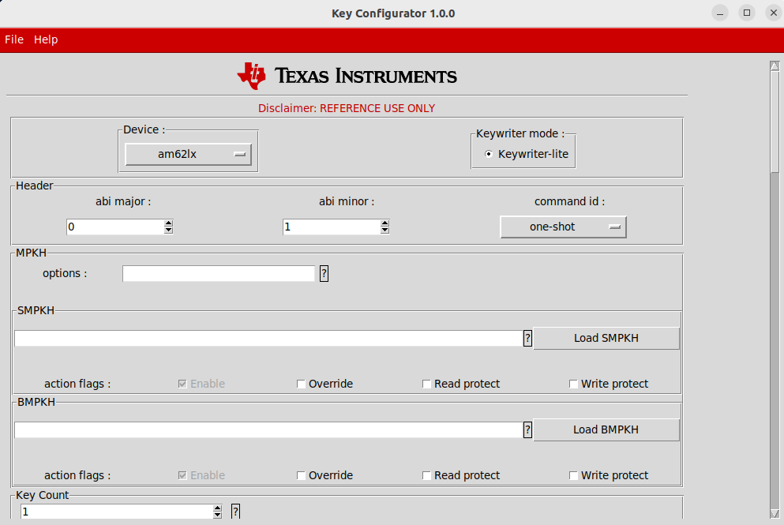

## Features

* Generate keywriter lite blob for all modes. Use the generated bin file as input to the U-Boot prompt as described in the user guide for keywriter-lite here:
[uboot keywriter lite](https://software-dl.ti.com/processor-sdk-linux/esd/AM62LX/latest/exports/docs/linux/Foundational_Components/U-Boot/UG-Key-Writer-Lite.html)
* Generate a C file with the keys configured to aid in review of the data.
* Save progress.
* Real-time data validation.

## Setup Instructions

### Dependencies

* git
* python3

### Installation

1. Clone the repository using `git clone ...`
2. Navigate to the key configurator tool sub-directory.
2. Launch the tool using `python3 key_configurator.py`.

## Usage

Select the desired command id from the command id drop down menu. Based on the selected command id the GUI gets updated, only the relevant widgets are exposed for users to interact with.

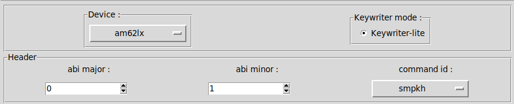

### MPK Options

Enter the 10-bits in the MPK as **hex** characters. Since the options field is reserved for future use, just value 0 is accepted as valid.

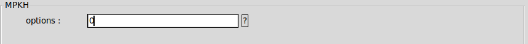

### SMPKH/BMPKH

There are two ways to enter the MPKH:

* Manually enter a 512-bits MPKH value as **hex** characters (128 hex characters).
* Use the load feature to automatically calculate and load the hash of a public key file into the smpkh/bmpkh box.

Set the desired action flags by checking appropriate action flags boxes near the bottom of the mpkh widget.

> Note: The enable flag can be unchecked only in multishot mode.

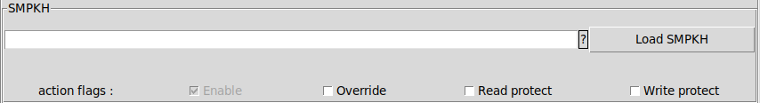

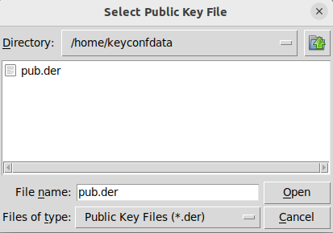

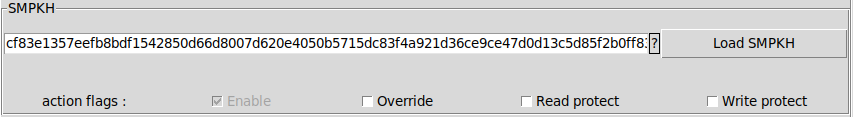

### Key Count

Use the spinbox to enter the right key count value.

Set the desired action flags by checking appropriate action flags boxes near the bottom of the key count widget.

> Note: The enable flag can be unchecked only in multishot mode.

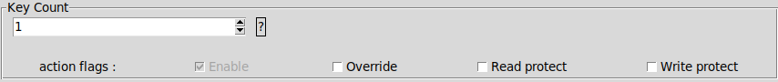

### Key Revision

Use the spinbox to enter the right key revision value.

Set the desired action flags by checking appropriate action flags boxes near the bottom of the key revision widget.

> Note: The enable flag can be unchecked only in multishot mode.

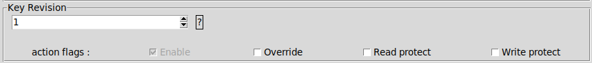

### SBL Software Revision

Use the spinbox to enter the right sbl software revision value.

Set the desired action flags by checking appropriate action flags boxes near the bottom of the sbl software revision widget.

> Note: The enable flag can be unchecked only in multishot mode.

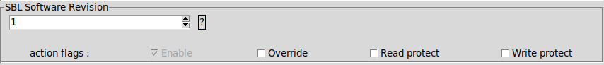

### SYSFW Software Revision

Use the spinbox to enter the right sysfw software revision value.

Set the desired action flags by checking appropriate action flags boxes near the bottom of the sysfw software revision widget.

> Note: The enable flag can be unchecked only in multishot mode.

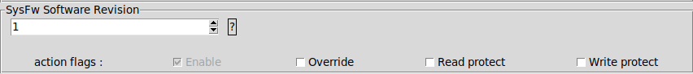

### Boardconfig Software Revision

Use the spinbox to enter the right boardconfig software revision value.

Set the desired action flags by checking appropriate action flags boxes near the bottom of the boardconfig software revision widget.

> Note: The enable flag can be unchecked only in multishot mode.

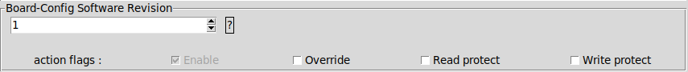

### Model Specific Value

Enter the 20-bits Model Specific value as **hex** characters.

Set the desired action flags by checking appropriate action flags boxes near the bottom of the msv widget.

> Note: The enable flag can be unchecked only in multishot mode.

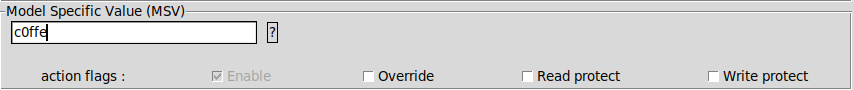

### JTAG Disable

This widget does not have an input box because the right value is set by the tool based on the enable flag state.
Set the desired action flags by checking appropriate action flags boxes near the bottom of the jtag-disable widget.

> Note: The enable flag can be unchecked only in multishot mode.

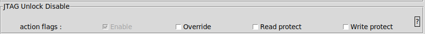

### Boot Mode

Use the spinbox to set the desired fuse index value. Enter the 25-bits boot mode value into the text box.
Set the desired action flags by checking appropriate action flags boxes near the bottom of the boot mode widget.

> Note: The enable flag can be unchecked only in multishot mode.

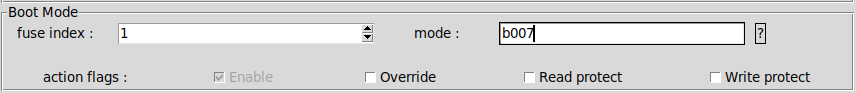

### Extended OTP

#### Extended OTP Data
Enter the number of bits to be programed and the offset using the respective boxes.

Manually enter the ext otp data in the text boxes. Based on the index and offset values, the relevant text boxes are highlighted in green.

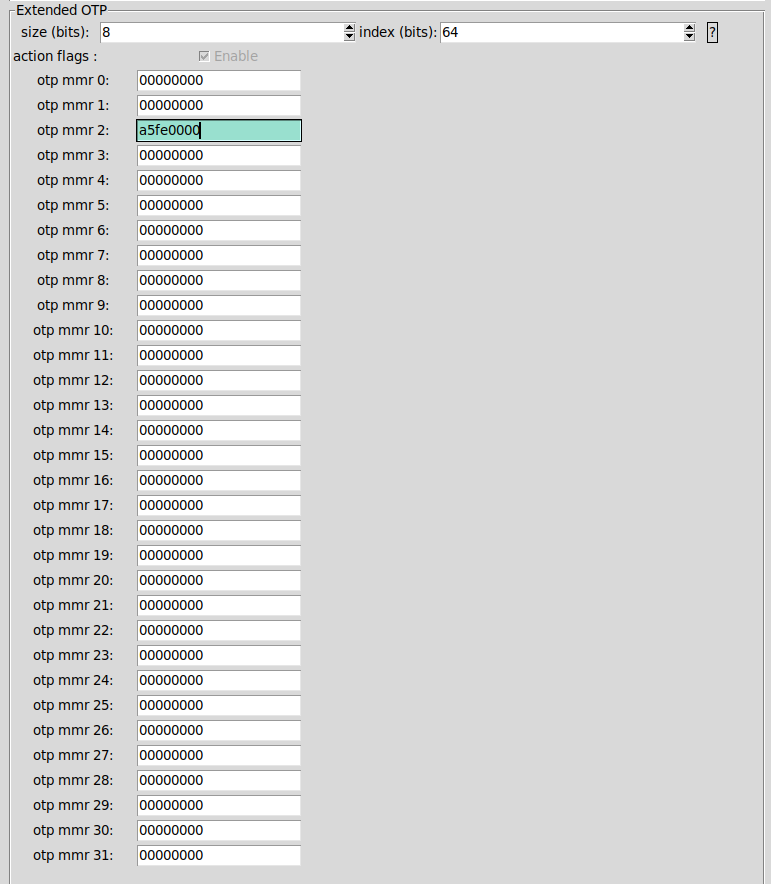

#### Read Protect and Write Protect Flags

To write protect a row, tick the wp checkbox in the action flags widget corresponding to that row number.

Similarly, to read protect a row, tick the rp checkbox in the action flags widget corresponding to that row number.

For example, to read protect row 10 and write protect row 11, the following selection would be needed.

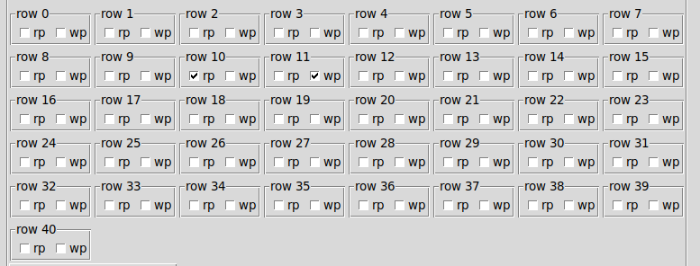

> Note: The enable flag can be unchecked only in multishot mode.

### Save and restore progress

To save progress click on File -> Save, then select location and file name. The progress would be saved in a json file.

To restore progress click on File -> Import, then select the saved JSON file.
The progress would be restored back.
